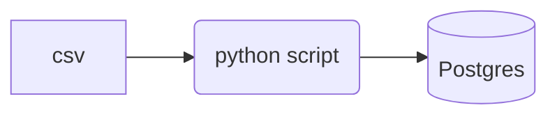

# Docker and SQL  <!-- omit in toc -->

This section will create a simple script to ingest data into a PostgreSQL database.

# Table of contents  <!-- omit in toc -->
- [Instructions to run](#instructions-to-run)
- [Data pipeline](#data-pipeline)

## Instructions to run

## Data pipeline

